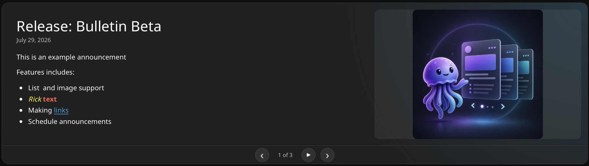

# JellyBulletin

<p align="center">
  
</p>

<p align="center"><strong>News and announcements on the Jellyfin home screen.</strong></p>



> Public beta. JellyBulletin is tested against Jellyfin 10.11.11 and currently
> targets Jellyfin Web and web-based clients.

JellyBulletin gives server administrators a rich-text editor for publishing
news, maintenance notices and other announcements. Every published bulletin is
visible to every Jellyfin user; there is intentionally no per-user access
control.

## Features

- Bold, italic, underline, text colors, links and ordered or unordered lists
- Optional uploaded, pasted, dropped or externally hosted images
- Optional text-only home-screen mode with two announcements on wide screens
- Image alternative text for accessibility
- Three to five recent announcements in a compact carousel
- Adaptive, compact, standard or tall announcement panel height
- Prominent, compact or visually hidden titles per bulletin
- Configurable automatic rotation with an accessible pause/start control
- Manual previous and next controls
- Drag-and-drop ordering and one pinned top announcement
- Optional publish and unpublish scheduling
- Theme-aware colors, surfaces, dividers and controls
- Live layout preview and overflow warning in the editor
- Automatic cleanup of uploaded images that are no longer referenced

## Dependencies

| Component | Status | Used for |
| --- | --- | --- |
| Jellyfin Server 10.11.11 | Required | Supported server and plugin ABI |
| Jellyfin Web or a web-based Jellyfin client | Required client | Renders the injected home-screen component |
| [File Transformation](https://github.com/IAmParadox27/jellyfin-plugin-file-transformation) | Required | Injects Bulletin into Jellyfin Web |
| [JellySpotlight](https://github.com/skijk/jellyfin-plugin-jellyspotlight) | Optional | Coordinates whether Spotlight rows appear before or after Bulletin |

Native clients that do not render Jellyfin Web are not currently supported.
JellyBulletin does not require Jelana, Playback Reporting, Radarr Watch, Jellyfin
Enhanced or JS Injector.

## Installation

1. Add the File Transformation repository to **Dashboard → Plugins →
   Repositories**:

   ```text
   https://www.iamparadox.dev/jellyfin/plugins/manifest.json
   ```

2. Install **File Transformation** and restart Jellyfin.
3. Add the JellyBulletin repository:

   ```text
   https://raw.githubusercontent.com/skijk/jellyfin-plugin-jellybulletin-repository/main/catalog-v2.json
   ```

4. Install **JellyBulletin** and restart Jellyfin.
5. Open **Dashboard → Plugins → Bulletin** to create announcements.

JellyBulletin's stable catalog is `catalog-v2.json`. Development builds are
published separately in `catalog-dev.json`; configure only the catalog you
intend to follow.

## Layout controls

The announcement panel height is configured globally under **Dashboard →
Plugins → Bulletin**:

- **Adaptive** follows the currently displayed content. Short notices use a
  low banner while longer text or an image is given more room.
- **Compact** keeps every bulletin in a low, fixed-height panel.
- **Standard** is the balanced fixed-height layout and remains the default for
  existing installations.
- **Tall** provides the largest fixed-height panel for detailed announcements.

Each bulletin also has its own **Title appearance** setting:

- **Prominent** uses the original large heading with the date below it.
- **Compact** uses a smaller heading and places the date on the same line.
- **Hidden on home screen** removes the visible heading and date from the home
  screen. The title remains required, stays visible in administration and is
  retained as an accessible label.

For a short, low-profile notice, combine **Adaptive** with a **Compact** or
**Hidden on home screen** title. Existing bulletins remain **Prominent** until
changed. The live preview reflects both settings before saving.

## Updating

Refresh the plugin catalog, install the offered JellyBulletin update and
restart Jellyfin. Configuration and uploaded images are retained between normal
updates.

## Removal and recovery

Uninstall JellyBulletin from the Dashboard and restart Jellyfin. Do not remove
File Transformation if another installed plugin depends on it.

If Jellyfin Web cannot load after an interrupted update, stop Jellyfin, move the
JellyBulletin plugin directory out of Jellyfin's plugin directory, then start
Jellyfin again. Keep the plugin configuration XML and JellyBulletin image
directory if you intend to reinstall and retain existing content.

## Known limitations

- Only Jellyfin 10.11.11 is currently tested.
- Support is limited to Jellyfin Web and web-based clients.
- All published announcements are visible to all authenticated users.
- Scheduling uses the Jellyfin server clock.
- External image URLs remain dependent on the external host.
- Long content scrolls inside Compact, Standard and Tall panels. Adaptive
  panels grow with their content up to a viewport-aware maximum and then
  scroll.
- File Transformation modifies Jellyfin Web during startup and is a required
  runtime dependency.

## Reporting bugs

Use [GitHub Issues](https://github.com/skijk/jellyfin-plugin-jellybulletin/issues)
and include the Jellyfin version, client/browser, JellyBulletin version,
File Transformation version, reproduction steps and relevant Jellyfin logs.

## Development

```bash
dotnet restore JellyBulletin.sln
dotnet build JellyBulletin.sln --configuration Release
node scripts/validate-assets.mjs
```

The project targets .NET 9 and builds against Jellyfin 10.11.11.

Development builds and their test checklist are documented in
[Development builds](docs/DEVELOPMENT.md).

## AI assistance disclosure

JellyBulletin was developed with extensive assistance from OpenAI Codex. The
project owner directed the product design, requirements and testing; Codex
assisted with implementation, review, release packaging and documentation.

## Media assets

The real [beta home-screen screenshot](docs/images/jellybulletin-home-beta.png),
generated [wide hero](docs/images/jellybulletin-hero.png) and
[square social image](docs/images/jellybulletin-social.png) may be used when
sharing or discussing JellyBulletin. Ready-to-use launch copy is available in
the [public-beta announcement](docs/BETA-ANNOUNCEMENT.md).

## License

[MIT](LICENSE)
